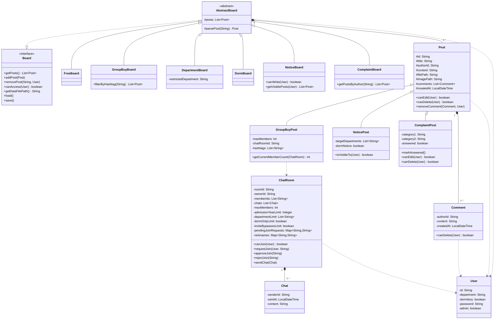
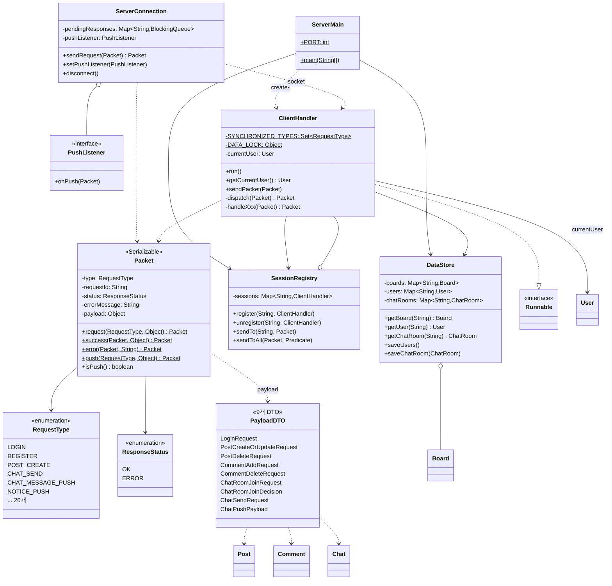

# 07. 클래스 다이어그램 작성용 정리

제출용 클래스 다이어그램(draw.io, StarUML 등)을 그릴 때 쓰는 정리본입니다.
getter/setter는 대부분 생략하고 다이어그램에서 **의미 있는 속성/메서드만** 추렸습니다.
전체 시그니처는 각 클래스 소스를 보세요.

> **다이어그램은 2장으로 나눠 그리는 것을 권장합니다.**
> 한 장에 다 넣으면 선이 너무 얽혀서 읽을 수 없습니다.
> - **1장: 엔티티 다이어그램** (§1~§3) — `User` / `Post` 계층 / `Board` 계층 / 채팅
> - **2장: 통신 계층 다이어그램** (§4~§6) — `Packet` / DTO / 서버·클라이언트 통신 클래스

---

# 1장 — 엔티티 다이어그램

## 1. 포함할 클래스 (17개)

### 1.1 회원

**User** «Serializable»
- 속성: `id`, `department`, `dormitory`, `password`, `admin`
- 메서드: `setDepartment()`, `setDormitory()`, `setPassword()` (관리자만 호출)
- `id`, `admin`은 `final`

### 1.2 게시글 (Post 계층)

**Post** «Serializable» — **`abstract`가 아닙니다.** 자유·학과·기숙사 게시글은
이 클래스를 **그대로 인스턴스화**합니다. 다이어그램에서 `«abstract»`를 붙이지 마세요.
- 속성: `id`, `title`, `authorId`, `content`, `filePath`, `imagePath`,
  `comments: List<Comment>`, `createdAt`
- 메서드: `canEdit(User)`, `canDelete(User)`, `addComment(Comment)`,
  `removeComment(Comment, User)`, `toDataString()`

**GroupBuyPost extends Post**
- 속성: `maxMembers`, `chatRoomId`, `hashtags: List<String>`
- 메서드: `getCurrentMemberCount(ChatRoom)`

**NoticePost extends Post**
- 속성: `targetDepartments: List<String>`, `dormNotice`
- 메서드: `isVisibleTo(User)`

**ComplaintPost extends Post**
- 속성: `category1`, `category2`, `answered`
- 메서드: `markAnswered()`, `canEdit(User)` «override», `canDelete(User)` «override»
  — 관리자는 민원을 수정·삭제할 수 없고 답변(댓글)만 할 수 있다
  ([02_requirements.md §3.5](02_requirements.md)). 다형성 예시로 발표에 쓸 만한 부분입니다.

**Comment** «Serializable»
- 속성: `authorId`, `content`, `createdAt`
- 메서드: `canDelete(User)`

### 1.3 게시판 (Board 계층)

**Board** «interface»
- 메서드: `getPosts()`, `addPost(Post)`, `removePost(String, User)`, `canAccess(User)`,
  `getDataFilePath()`, `load()`, `save()`

**AbstractBoard** «abstract», implements Board
- 속성: `posts: List<Post>`
- 메서드: `findPost(String)`, `parsePost(String)` «abstract»

**FreeBoard** — 접근 제한 없음
**GroupBuyBoard** — `filterByHashtag(String)`
**DepartmentBoard** — 속성 `restrictedDepartment`, `dataFilePath`
**DormBoard** — 기숙사생 전용
**NoticeBoard** — `canWrite(User)`, `getVisiblePosts(User)`
**ComplaintBoard** — 관리자 전용, `getPostsByAuthor(String)`

> `Board` 계열은 **서버에만 존재하며 `Serializable`이 아닙니다.**

### 1.4 채팅

**Chat** «Serializable»
- 속성: `senderId`, `sentAt`, `content`

**ChatRoom** «Serializable»
- 속성: `roomId`, `ownerId`, `memberIds: List<String>`, `chats: List<Chat>`, `maxMembers`,
  `admissionYearLimit`, `departmentLimit: List<String>`, `dormOnlyLimit`, `inviteBypassesLimit`,
  `pendingJoinRequests: Map<String,String>`, `nicknames: Map<String,String>`
- 메서드: `canJoin(User)`, `requestJoin(User, String)`, `approveJoin(String)`,
  `rejectJoin(String)`, `setNickname(String, String)`, `sendChat(Chat)`

### 1.5 부록 처리 권장

**DataFormat**, **FileStorage** — 구분자 상수와 파일 I/O만 담당하는 순수 유틸리티라
클래스 간 관계(상속/연관)가 없습니다. 넣더라도 `«utility»` 스테레오타입으로 **구석에 독립 박스만**
표시하고 관계선은 그리지 않는 것을 권장합니다.

## 2. 관계

| 관계 | 유형 | 비고 |
|---|---|---|
| `AbstractBoard` ⇢ `Board` | 인터페이스 구현 (점선 삼각형) | |
| 게시판 6종 → `AbstractBoard` | 상속 (실선 삼각형) | |
| `GroupBuyPost`, `NoticePost`, `ComplaintPost` → `Post` | 상속 (실선 삼각형) | |
| `AbstractBoard` ◆— `Post` | 컴포지션 (1 : 0..*) | 게시판이 사라지면 게시글도 사라짐 |
| `Post` ◆— `Comment` | 컴포지션 (1 : 0..*) | |
| `ChatRoom` ◆— `Chat` | 컴포지션 (1 : 0..*) | |
| `Post` ···> `User` | 의존 (점선 화살표) | `canEdit(User)`/`canDelete(User)` 매개변수로만 사용 |
| `Comment` ···> `User` | 의존 | `canDelete(User)` |
| `ChatRoom` ···> `User` | 의존 | `canJoin(User)`, `requestJoin(User, ...)` |
| `AbstractBoard` ···> `User` | 의존 | `canAccess(User)`, `removePost(..., User)` |
| `GroupBuyPost` ···> `ChatRoom` | 의존 | `getCurrentMemberCount(ChatRoom)` |

> **중요:** `ChatRoom.ownerId`/`memberIds`, `Post.authorId`, `Comment.authorId`는 `User`를
> 직접 참조하지 않고 **`String id`로만 느슨하게 연결**되어 있습니다 (파일 기반 저장 구조상
> 자연스러운 설계). 실선 연관으로 그리지 말고 위 표처럼 **의존(점선)** 또는 주석으로
> "id 참조"라고 표시하세요.

## 3. 그리기 순서 제안

1. 좌측: `User` 단독 배치 (다른 모든 그룹이 점선으로 참조)
2. 중앙 상단: `Post` 계층 + `Comment`
3. 중앙 하단: `Board` → `AbstractBoard` → 게시판 6종
4. 우측: `ChatRoom` + `Chat` (`GroupBuyPost`와 점선 연결)
5. 구석: `DataFormat`, `FileStorage` (선택)

## 3-1. 참고용 Mermaid 초안 (엔티티)

---

# 2장 — 통신 계층 다이어그램

## 4. 클래스 (17개)

### 4.1 `model.protocol` — 봉투 (3개)

**Packet** «Serializable»
- 속성: `type: RequestType`, `requestId: String`, `status: ResponseStatus`,
  `errorMessage: String`, `payload: Object`
- 메서드: `«static» request(RequestType, Object)`, `«static» success(Packet, Object)`,
  `«static» error(Packet, String)`, `«static» push(RequestType, Object)`, `isPush()`
- **생성자는 private** — 위 정적 팩토리 4개로만 생성

**RequestType** «enumeration» — **20개**
`LOGIN`, `REGISTER`, `LOGOUT`, `USER_UPDATE`, `USER_LOOKUP`, `POST_LIST`, `POST_CREATE`,
`POST_UPDATE`, `POST_DELETE`, `COMMENT_ADD`, `COMMENT_DELETE`, `CHATROOM_CREATE`,
`CHATROOM_JOIN_REQUEST`, `CHATROOM_JOIN_APPROVE`, `CHATROOM_JOIN_REJECT`, `CHAT_SEND`,
`CHATROOM_LIST`, `CHAT_MESSAGE_PUSH`, `NOTICE_PUSH`, `DISCONNECT`

**ResponseStatus** «enumeration» — `OK`, `ERROR`

**BoardKey** «utility» — 게시판 이름표 상수 5개. 관계선 없이 독립 박스 권장.

### 4.2 `model.protocol` — payload DTO (9개, 전부 «Serializable» + 불변)

| 클래스 | 속성 | 사용 RequestType |
|---|---|---|
| `LoginRequest` | `id`, `password` | `LOGIN` |
| `PostCreateOrUpdateRequest` | `boardKey`, `post: Post` | `POST_CREATE`, `POST_UPDATE` |
| `PostDeleteRequest` | `boardKey`, `postId` | `POST_DELETE` |
| `CommentAddRequest` | `boardKey`, `postId`, `comment: Comment` | `COMMENT_ADD` |
| `CommentDeleteRequest` | `boardKey`, `postId`, `commentIndex: int` | `COMMENT_DELETE` |
| `ChatRoomJoinRequest` | `roomId`, `message` | `CHATROOM_JOIN_REQUEST` |
| `ChatRoomJoinDecision` | `roomId`, `userId` | `CHATROOM_JOIN_APPROVE/REJECT` |
| `ChatSendRequest` | `roomId`, `content` | `CHAT_SEND` |
| `ChatPushPayload` | `roomId`, `chat: Chat` | `CHAT_MESSAGE_PUSH` |

> DTO가 9개나 되므로 다이어그램에서는 **`Packet` 하나만 크게 그리고 DTO들은 묶음 박스 하나로
> 처리한 뒤 `Packet ···> DTO «payload»` 점선 하나**로 연결하는 편이 읽기 좋습니다.

### 4.3 `client.CT` — 클라이언트 통신 (2개)

**ServerConnection**
- 속성: `socket`, `out: ObjectOutputStream`, `in: ObjectInputStream`,
  `pendingResponses: Map<String, BlockingQueue<Packet>>`, `pushListener: PushListener`
- 메서드: `sendRequest(Packet): Packet` (응답까지 블로킹, 10초 타임아웃),
  `setPushListener(PushListener)`, `disconnect()`, `-sendPacket(Packet)`, `-readLoop()`
- 내부에 리더 스레드 1개를 데몬으로 실행

**PushListener** «interface»
- 메서드: `onPush(Packet)` — GUI(`ChatRoomPanel`)가 구현해서 등록

### 4.4 `server.CT` / `server.board` — 서버 (3개)

**ServerMain**
- 속성: `«static» PORT = 5000`
- 메서드: `«static» main(String[])` — accept 루프, 접속마다 `ClientHandler` 스레드 생성

**ClientHandler** implements `Runnable`
- 속성: `«static» SYNCHRONIZED_TYPES: Set<RequestType>`, `«static» DATA_LOCK: Object`,
  `socket`, `dataStore: DataStore`, `sessionRegistry: SessionRegistry`, `out`, `in`,
  `currentUser: User` (`volatile`)
- 메서드: `run()`, `getCurrentUser()`, `sendPacket(Packet)`, `-handleRequest(Packet)`,
  `-dispatch(Packet)`, `-handleXxx(Packet) Packet «17 methods»`,
  `-requireLogin/requireAdmin/requireAccess/requirePostType(...)`
- 다이어그램에는 `handleXxx` 17개를 나열하지 말고 **`-handleXxx(Packet) Packet «17 methods»`**
  로 축약할 것

**SessionRegistry**
- 속성: `sessions: Map<String, ClientHandler>` (`ConcurrentHashMap`)
- 메서드: `register(String, ClientHandler)`, `unregister(String, ClientHandler)`,
  `sendTo(String, Packet)`, `sendToAll(Packet, Predicate<User>)`

**DataStore**
- 속성: `boards: Map<String, Board>`, `users: Map<String, User>`, `chatRooms: Map<String, ChatRoom>`
- 메서드: `getBoard/getUser/hasUser/addUser/saveUsers/getChatRoom/addChatRoom/
  getAllChatRooms/saveChatRoom`, `-registerBoards()`, `-loadAll()`

## 5. 관계

| 관계 | 유형 | 비고 |
|---|---|---|
| `ClientHandler` ⇢ `Runnable` | 구현 | |
| `ServerMain` ···> `ClientHandler` | 의존 (생성) | 접속마다 `new Thread(new ClientHandler(...))` |
| `ServerMain` → `DataStore`, `SessionRegistry` | 연관 (1 : 1) | 각각 하나만 만들어 공유 |
| `ClientHandler` → `DataStore` | 연관 (1 : 1) | 생성자 주입, 모든 핸들러가 **같은 인스턴스** |
| `ClientHandler` → `SessionRegistry` | 연관 (1 : 1) | 생성자 주입 |
| `SessionRegistry` ◇— `ClientHandler` | 집합 (1 : 0..*) | 접속 중인 핸들러 목록 |
| `DataStore` ◇— `Board` | 집합 (1 : 8) | 게시판 레지스트리 |
| `DataStore` ◇— `User`, `ChatRoom` | 집합 (1 : 0..*) | |
| `ServerConnection` ◇— `PushListener` | 집합 (0..1) | `setPushListener`로 주입 |
| `ServerConnection` ↔ `ClientHandler` | 연관 «socket» | 실제 코드상 직접 참조 없음 — 점선 + 노트로 표기 |
| `ServerConnection`, `ClientHandler`, `PushListener` ···> `Packet` | 의존 | 송수신 파라미터/반환 |
| `Packet` → `RequestType`, `ResponseStatus` | 연관 (1 : 1) | |
| `Packet` ···> DTO 9개 | 의존 «payload» | `payload: Object` 타입이라 컴파일 시점 관계는 없음 — 점선 |
| `PostCreateOrUpdateRequest` → `Post` | 연관 | DTO가 엔티티를 품음 |
| `CommentAddRequest` → `Comment` | 연관 | |
| `ChatPushPayload` → `Chat` | 연관 | |
| `ClientHandler` → `User` | 연관 (0..1, `currentUser`) | 로그인 세션 |

## 6. 참고용 Mermaid 초안 (통신 계층)

