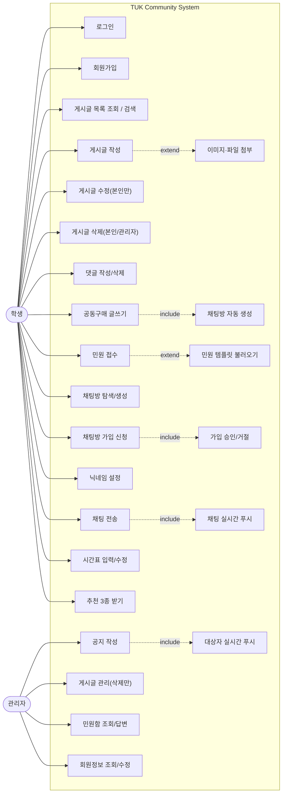

# 09. 유스케이스 다이어그램 작성용 정리

제출용 유스케이스 다이어그램(draw.io, StarUML 등)을 그릴 때 쓰는 정리본입니다.
Mermaid는 유스케이스 다이어그램을 정식으로 지원하지 않으므로, §4의 초안은 **참고용
근사치(flowchart로 흉내)** 이고 실제 제출물은 이 문서의 표를 보고 draw.io/StarUML로
직접 그리세요. 근거는 전부 [02_requirements.md](02_requirements.md)의 절 번호로 달아뒀습니다.

---

## 1. 액터 (2명)

| 액터 | 설명 |
|---|---|
| **학생** | 로그인한 일반 사용자. `HomePanel`(§1.2, [06_gui.md](06_gui.md))로 진입 |
| **관리자** | `AdminPanel`로만 진입. **학생 화면과 시스템 경계 자체가 분리**되어 있어
  두 액터가 겹치는 유스케이스가 거의 없다 ([02_requirements.md §1.2](02_requirements.md)) |

> 두 액터를 상속(일반화 화살표)으로 묶지 마세요. "관리자는 학생이 할 수 있는 것도 다 할 수
> 있다"가 **성립하지 않습니다** — 관리자는 회원가입/게시글 작성(공지 제외)/채팅/추천을 하지
> 않고, 학생은 공지 작성/게시글 관리/민원함/회원정보 수정을 못 합니다.

시스템 경계 이름: **TUK Community System**

---

## 2. 유스케이스 목록 (카테고리별)

### 2.1 회원/인증 — 액터: 학생 (§1)

| 유스케이스 | 설명 | 근거 |
|---|---|---|
| 회원가입 | 학번·학과(3단 드롭다운)·기숙사 여부·비밀번호 입력 | §1.1 |
| 로그인 | 성공 시 관리자/학생 화면 분기 | §1.2 |
| 로그아웃 | | §1.2 |

> 회원정보 변경(전과·비번 재설정 등)은 학생이 스스로 하는 유스케이스가 **아닙니다** —
> 전부 "관리자 문의"로 처리되어 관리자 쪽 유스케이스(§2.5)로만 존재합니다 (§1.3).

### 2.2 게시판 공통 — 액터: 학생 (§2)

| 유스케이스 | 설명 | 근거 |
|---|---|---|
| 게시글 목록 조회 | 게시판별 접근 권한에 따라 필터링됨 | §2.3 |
| 게시글 검색 | 클라이언트 필터링 (`POST_LIST` 재사용) | §2.2-7 |
| 게시글 작성 | «extend» 이미지/파일 첨부 | §2.1 |
| 게시글 수정 | **본인 글만** (관리자 제외, §2.2 규칙 1) | §2.2 |
| 게시글 삭제 | 본인 또는 관리자 (민원 제외) | §2.2 |
| 댓글 작성 | 누구나 | §2.2-5 |
| 댓글 삭제 | 본인 또는 관리자 | §2.2-5 |

### 2.3 게시판별 — 액터: 학생 (§3)

| 유스케이스 | 설명 | 근거 |
|---|---|---|
| 자유게시판 이용 | 전체 조회/작성 | §2.3 |
| 공동구매 글쓰기 | «include» 채팅방 자동 생성·연동, 해시태그 지정 | §3.1 |
| 공동구매 채팅방 입장 | 연결된 채팅방으로 이동 (참여자 아니면 가입 신청 유스케이스로 «include») | §3.1, [08_status.md] |
| 학과 게시판 이용 | 본인 학과만 (관리자는 전체) | §3.2 |
| 기숙사 게시판 이용 | 기숙사생만 | §3.3 |
| 공지사항 조회 | 대상 필터링된 공지만 (`isVisibleTo`) | §3.4 |
| 민원 접수 | «extend» 템플릿 불러오기 | §3.5 |
| 내 민원 내역 조회 | 본인이 넣은 것만 | §3.5 |

### 2.4 채팅 — 액터: 학생 (§4)

| 유스케이스 | 설명 | 근거 |
|---|---|---|
| 채팅방 탐색/검색 | 이름 검색, 가입 채팅방(공동구매/일반 탭 분리) | §4.4 |
| 채팅방 생성 | 정원·입학년도·학과·기숙사 제한 설정 | §4.1 |
| 채팅방 가입 신청 | 가입지원 메시지 포함 | §4.2 |
| 가입 신청 승인/거절 | **방장만** — 신청 시점에 제한 재검사됨 | §4.2 |
| 닉네임 설정 | 방마다 별도, 입장 시/언제든 변경 | §4.2 |
| 채팅 전송 | 다른 참여자에게 실시간 푸시 | §4.3 |

### 2.5 추천 — 액터: 학생 (§5, 서버 통신 없음)

| 유스케이스 | 설명 | 근거 |
|---|---|---|
| 시간표 입력/수정 | 1교시 09:30부터 1시간 단위, 9교시까지 | §5.1 |
| 할 거 추천 받기 | 시간표 기반 공강 자동 인식 | §5.1 |
| 메뉴 추천 받기 | 오늘의 학식 + 랜덤 식당 2곳, 다시 받기 | §5.2 |
| 책 추천 받기 | 학과별 랜덤 1권 | §5.3 |

### 2.6 관리자 전용 — 액터: 관리자 (§1.3, §6)

| 유스케이스 | 설명 | 근거 |
|---|---|---|
| 공지 작성 | 대상 학과(복수)·기숙사 여부 지정 → «include» 대상자 실시간 푸시 | §3.4, §6 |
| 공지 수정 | 자기가 쓴 것만 (공지는 작성자=관리자이므로 일반 규칙과 동일) | §2.2 |
| 게시글 관리(삭제) | 모든 게시판 대상, **수정은 불가** | §6 |
| 민원함 조회 | 전체 민원 열람 | §3.5 |
| 민원 답변 | 댓글로만, 자동으로 답변완료 처리. 수정/삭제 불가 | §3.5 |
| 회원정보 조회/수정 | 학번 조회 → 학과/기숙사/비밀번호만 | §1.3 |

---

## 3. 관계 정리 (include / extend)

| 기준 유스케이스 | 관계 | 대상 | 조건/비고 |
|---|---|---|---|
| 게시글 작성 | «extend» | 이미지/파일 첨부 | 선택적 (§2.2-6) |
| 공동구매 글쓰기 | «include» | 채팅방 자동 생성 | 항상 발생 (§3.1) |
| 공동구매 채팅방 입장 | «include» | 채팅방 가입 신청 | 참여자가 아닐 때만 (`09_..` 규칙, [CLAUDE.md §2-1]) |
| 민원 접수 | «extend» | 템플릿 불러오기 | 선택적 (§3.5) |
| 공지 작성 | «include» | 대상자 실시간 푸시 | 항상 발생, 접속 중인 대상자만 (§3.4) |
| 채팅 전송 | «include» | 실시간 푸시 | 항상 발생, 나 자신은 제외 (§4.3) |
| 민원 답변 | «include» | 답변완료 상태 전환 | 관리자 댓글 작성 시 자동 (§3.5) |
| 채팅방 가입 신청 | «include» | 가입 신청 승인/거절 | 방장이 처리 (§4.2) |
| 할 거 추천 받기 | «include» | 시간표 입력/수정 (선행 조건) | 시간표가 없으면 추천 불가 (§5.1) |

> 학생 쪽 유스케이스는 전부 **로그인이 선행 조건**이지만, 화살표를 전부 로그인에
> «include»로 그리면 그림이 지저분해집니다. 대신 시스템 경계 밖에 "※ 모든 유스케이스는
> 로그인 후 접근" 주석 한 줄로 처리하는 것을 권장합니다 ([01_overview.md] 실행 전제와 동일).

---

## 4. 참고용 Mermaid 초안 (flowchart로 근사)

