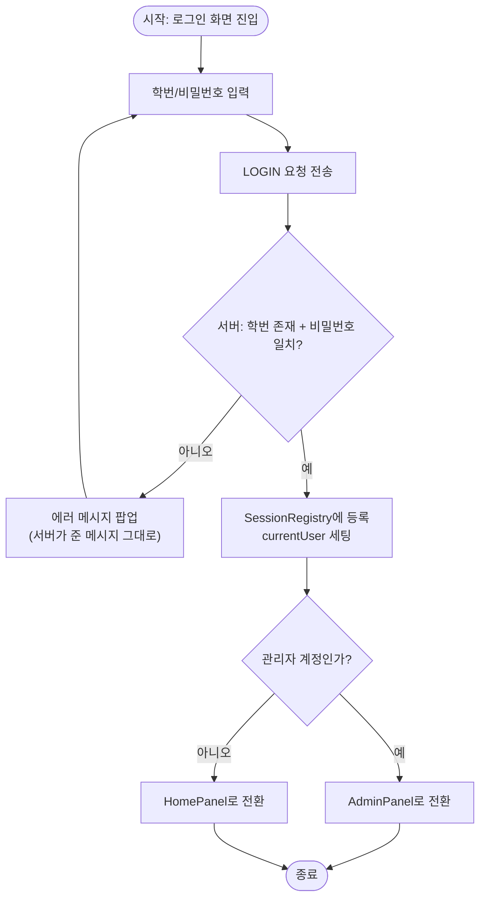
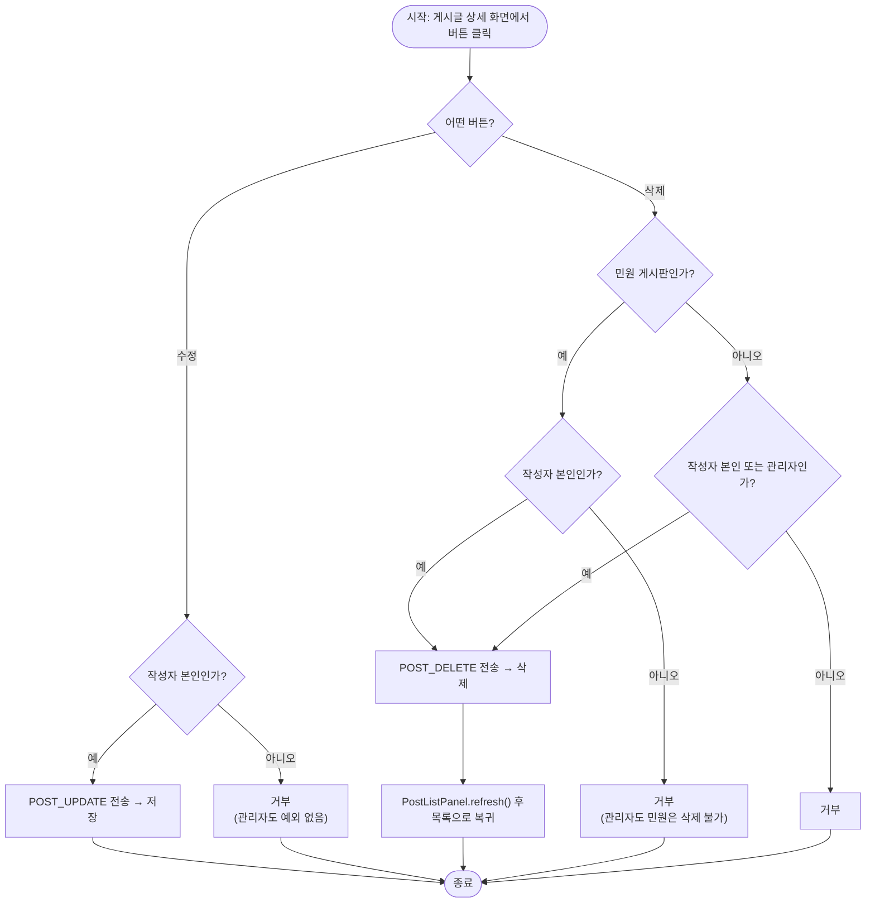
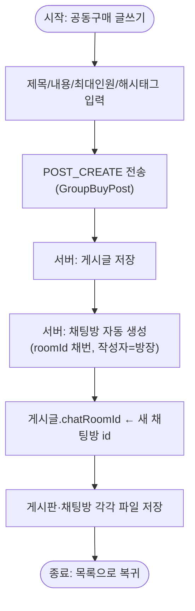
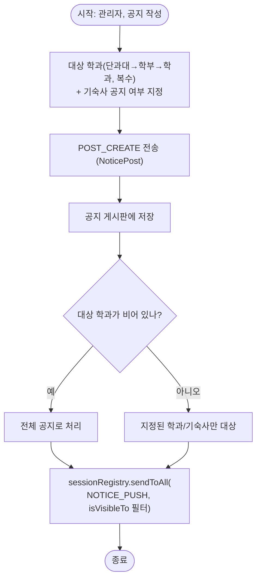
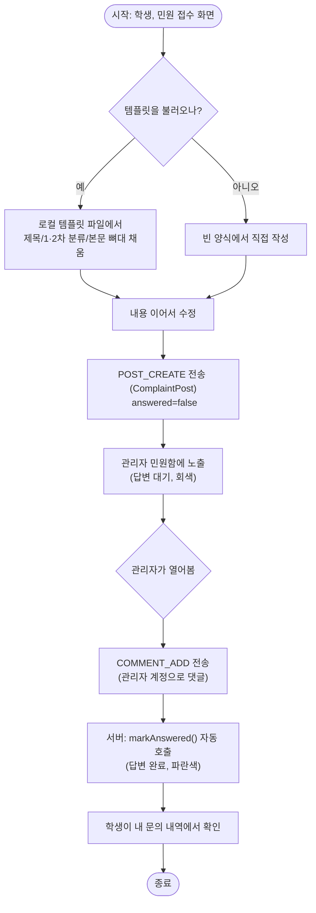

# 10. 액티비티 다이어그램 작성용 정리

제출용 액티비티 다이어그램(draw.io, StarUML 등)을 그릴 때 쓰는 정리본입니다.
Mermaid `flowchart`로 근사한 초안을 각 흐름마다 붙여뒀습니다 — 시작/종료는 스타디움 노드,
분기는 마름모, 동작은 사각형입니다. 실선 화살표는 흐름, 근거 절 번호는 각 다이어그램
제목 옆에 달아뒀습니다.

**8개를 골랐습니다 — 전부 그릴 필요는 없고, 분기가 있어서 "액티비티 다이어그램다운"
흐름 위주로 뽑았습니다.** 나머지 단순 CRUD(자유게시판 글쓰기 등)는 §3의 "게시글
작성/수정/삭제 권한 판단"과 사실상 동일한 골격이라 생략했습니다.

---

## 1. 로그인 및 화면 분기 ([02_requirements.md §1.2](02_requirements.md))



---

## 2. 게시글 수정/삭제 권한 판단 ([02_requirements.md §2.2](02_requirements.md))

민원 게시판만 예외 경로를 타는 것이 이 다이어그램의 핵심입니다 (`ComplaintPost`가
`canEdit`/`canDelete`를 오버라이드).



> 서버는 클라이언트가 버튼을 숨기든 말든 **같은 판정을 다시** 합니다
> ([03_architecture.md §1](03_architecture.md)). 이 다이어그램은 클라이언트·서버 양쪽에서
> 동일하게 적용되는 판정 로직이라 화면 흐름과 서버 흐름을 하나로 합쳐 그렸습니다.

---

## 3. 공동구매 글쓰기 — 채팅방 자동 생성 ([02_requirements.md §3.1](02_requirements.md))



---

## 4. 채팅방 가입 절차 ([02_requirements.md §4.2](02_requirements.md))

```mermaid
flowchart TD
    start([시작: 채팅방 상세에서 "가입 신청"]) --> already{이미 참여 중인가?}
    already -- 예 --> deny1["신청 불가 안내"]
    already -- 아니오 --> limitCheck{정원·입학년도·학과·기숙사\n제한을 모두 통과하는가?}
    limitCheck -- 아니오 --> deny2["신청 거부\n(서버 에러 메시지 표시)"]
    limitCheck -- 예 --> msg["가입지원 메시지 입력"]
    msg --> submit["CHATROOM_JOIN_REQUEST 전송"]
    submit --> pending["pendingJoinRequests에 등록"]
    pending --> wait["방장의 처리 대기"]
    wait --> decision{방장이 승인?}
    decision -- 승인 --> approve["CHATROOM_JOIN_APPROVE\nmemberIds에 추가"]
    decision -- 거절 --> reject["CHATROOM_JOIN_REJECT\n신청 삭제"]
    approve --> nickname["닉네임 설정(선택)"]
    nickname --> fin([종료: 채팅방 입장])
    reject --> fin2([종료: 신청 목록에서 제거됨])
    deny1 --> fin3([종료])
    deny2 --> fin3
```

---

## 5. 실시간 채팅 전송 + 푸시 ([02_requirements.md §4.3](02_requirements.md))

```mermaid
flowchart TD
    start([시작: 메시지 입력 후 전송]) --> member{참여 중인 방인가?}
    member -- 아니오 --> deny["CHAT_SEND 거부"]
    member -- 예 --> send["CHAT_SEND 전송"]
    send --> serverSave["서버: Chat 생성 → room.sendChat() → 파일 저장"]
    serverSave --> loop["같은 방의 다른 멤버 각각에 대해"]
    loop --> online{그 멤버가 접속 중인가?\n(SessionRegistry)}
    online -- 예 --> push["CHAT_MESSAGE_PUSH 전송\n→ onPush()에서 화면 갱신"]
    online -- 아니오 --> skip["조용히 무시\n(다음 목록 조회 때 확인)"]
    push --> more{다른 멤버 더 있나?}
    skip --> more
    more -- 예 --> loop
    more -- 아니오 --> fin([종료])
    deny --> fin
```

> 보낸 사람 본인은 응답으로 이미 알고 있으므로 푸시 대상에서 제외됩니다
> ([03_architecture.md §4](03_architecture.md)).

---

## 6. 공지 작성 + 대상자 실시간 푸시 ([02_requirements.md §3.4](02_requirements.md))



---

## 7. 민원 접수 → 관리자 답변 ([02_requirements.md §3.5](02_requirements.md))



> 관리자는 이 흐름에서 수정·삭제 분기 자체가 없습니다 — `ComplaintPost.canEdit`/`canDelete`가
> 관리자에게도 항상 `false`를 반환하기 때문입니다 ([02_requirements.md §3.5](02_requirements.md)).

---

## 8. 할 거 추천 — 시간표 기반 공강 인식 ([02_requirements.md §5.1](02_requirements.md))

```mermaid
flowchart TD
    start([시작: "할 거" 탭 진입]) --> hasTable{시간표가 입력되어 있나?}
    hasTable -- 아니오 --> goEdit["시간표 입력 화면으로 이동"]
    goEdit --> save["저장(로컬 파일)"]
    save --> recompute["추천 재계산"]
    hasTable -- 예 --> now["오늘 날짜 + 현재 시각 확인"]
    now --> status{현재 상태?}
    status -- 수업 중 --> inClass["추천 없음: IN_CLASS 안내"]
    status -- 오늘 수업 없음 --> unlimited["제한 없음: UNLIMITED\n(가장 긴 목록에서 추천)"]
    status -- 공강 --> gap["다음 수업까지 남은 분(free minutes) 계산"]
    gap --> filter["소요시간 ≤ 남은 분인 항목만 필터\n(목록은 49분 이하로 구성)"]
    filter --> pick{조건에 맞는 항목이 있나?}
    pick -- 예 --> show["랜덤 1개 추천"]
    pick -- 아니오 --> none["추천 없음 안내"]
    recompute --> now
    inClass --> fin([종료])
    unlimited --> fin
    show --> fin
    none --> fin
```
