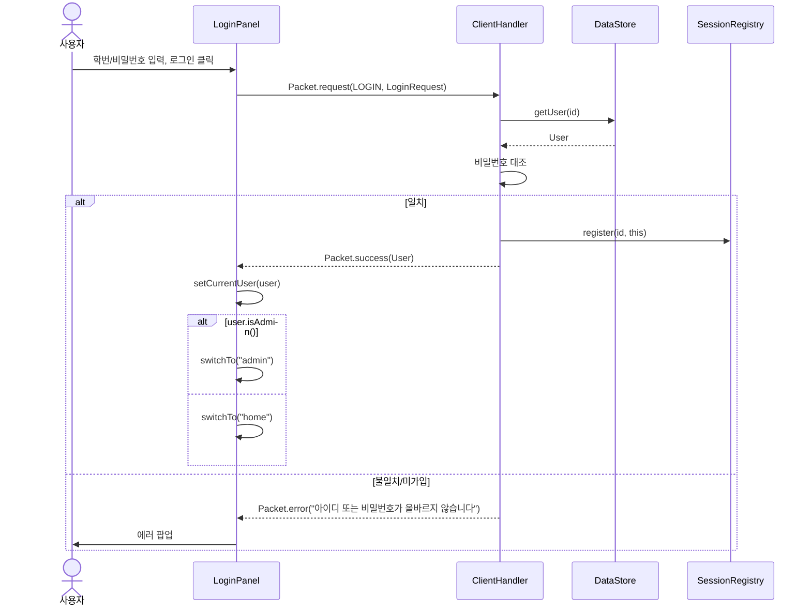
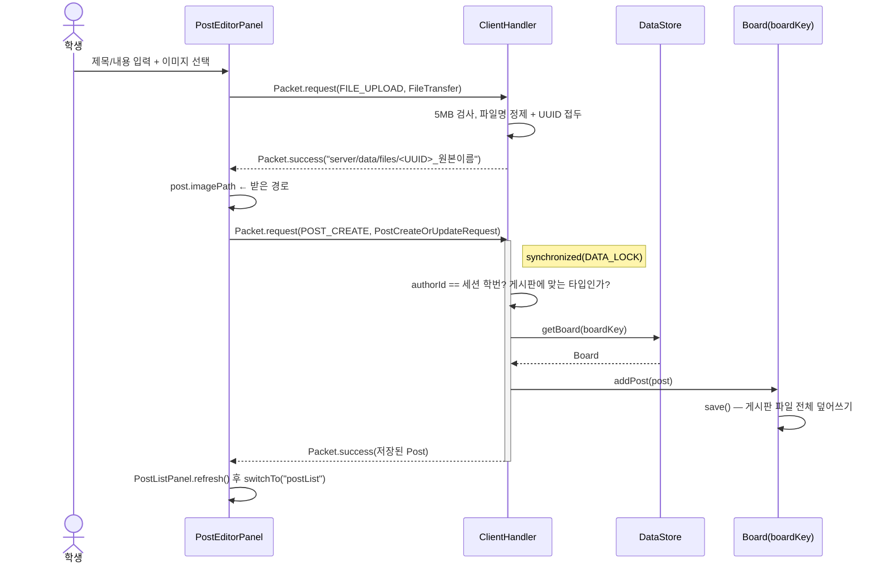
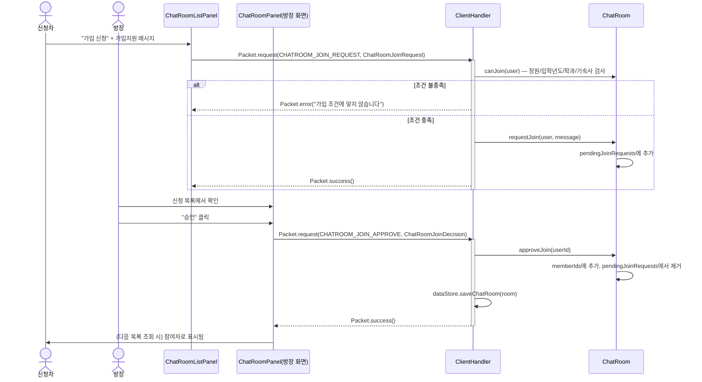
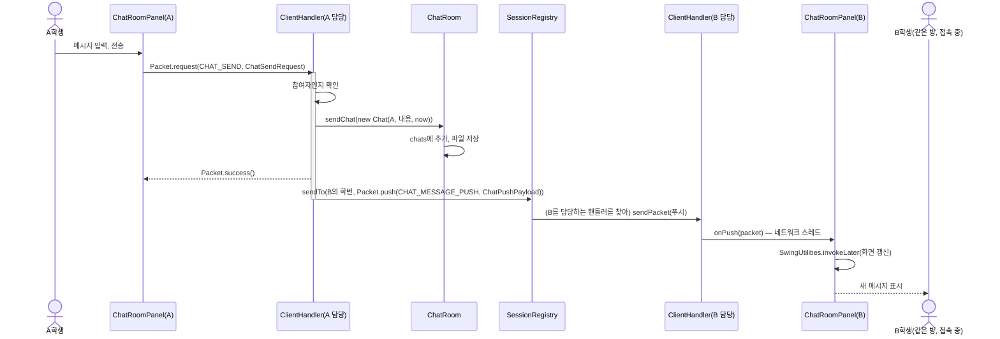
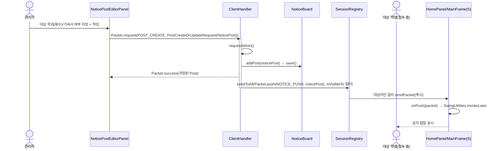
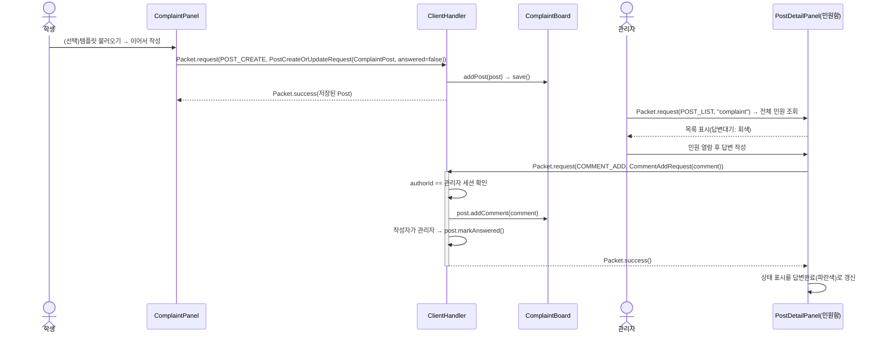

# 11. 시퀀스 다이어그램 작성용 정리

제출용 시퀀스 다이어그램(draw.io, StarUML 등)을 그릴 때 쓰는 정리본입니다. Mermaid는
시퀀스 다이어그램을 정식으로 지원하므로 아래 초안은 거의 그대로 옮겨 그릴 수 있습니다.
참여 객체 이름은 실제 클래스명을 그대로 썼습니다 ([03_architecture.md](03_architecture.md),
[05_protocol.md](05_protocol.md) 기준).

**공통 규약(모든 다이어그램에 적용, 반복 표기 생략):**

- 클라이언트 → 서버 화살표는 실제로는 `ServerConnection.sendRequest(Packet)` 한 번
  호출이지만, 가독성을 위해 "패널 → ClientHandler"로 직접 그렸습니다.
- 요청/응답은 전부 `Packet`으로 감싸져 있습니다 (`Packet.request` / `Packet.success` /
  `Packet.error`). 매 메시지마다 "Packet(...)" 이라고 다 적으면 지저분해지므로 페이로드
  이름만 표기했습니다.
- 데이터를 바꾸는 요청(✔ 표시)은 서버 쪽에서 `synchronized(DATA_LOCK)` 블록 안에서
  처리됩니다 ([03_architecture.md §5](03_architecture.md)). 다이어그램에 `activate`/`note`로
  한 번만 표시해도 충분합니다.

---

## 1. 로그인 ([03_architecture.md §3](03_architecture.md) 원문의 정식 다이어그램화)

---

## 2. 게시글 작성 (이미지 첨부 포함) ([05_protocol.md §2.3](05_protocol.md))

첨부가 있는 경우 `FILE_UPLOAD`가 `POST_CREATE`보다 **먼저** 끝나야 합니다.

---

## 3. 채팅방 가입 신청 → 승인 ([02_requirements.md §4.2](02_requirements.md))

---

## 4. 실시간 채팅 전송 + 푸시 ([03_architecture.md §4](03_architecture.md) 원문의 정식 다이어그램화)

---

## 5. 공지 작성 + 대상자 실시간 푸시 ([02_requirements.md §3.4](02_requirements.md))

---

## 6. 민원 접수 및 관리자 답변 ([02_requirements.md §3.5](02_requirements.md))

