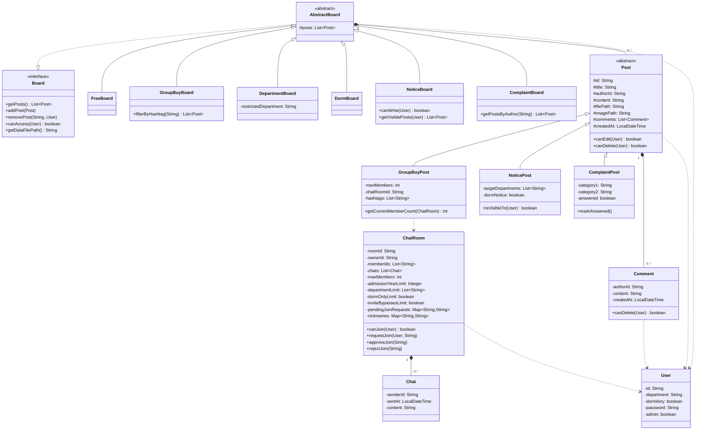
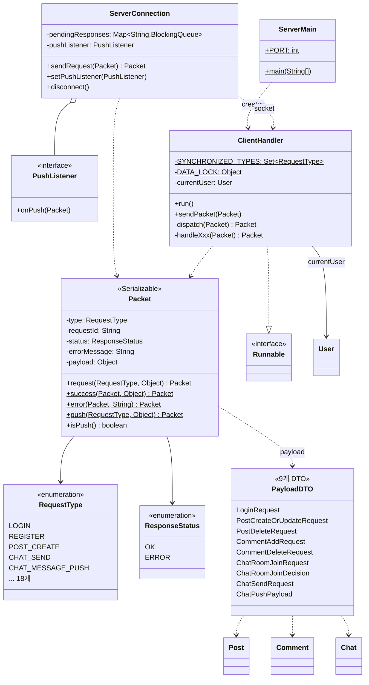

# 클래스 다이어그램 작성용 정리

이 문서는 `model/` 패키지 소스와 `documents/datastruct.md` 명세를 기준으로, 클래스 다이어그램에
그려야 할 클래스와 관계를 정리한 것입니다. getter/setter는 대부분 생략하고 다이어그램에서
의미 있는 속성/메서드만 추렸습니다. (전체 시그니처는 각 클래스 소스 참고)

---

## 1. 다이어그램에 포함할 클래스 (17개)

### 1.1 회원

**User**
- 속성: `id`, `department`, `dormitory`, `password`, `admin`
- 메서드: `setDepartment()`, `setDormitory()`, `setPassword()` (관리자만 호출)

### 1.2 게시글 (Post 계층)

**Post** («abstract»)
- 속성: `id`, `title`, `authorId`, `content`, `filePath`, `imagePath`, `comments: List<Comment>`, `createdAt`
- 메서드: `canEdit(User)`, `canDelete(User)`, `addComment(Comment)`, `toDataString()` («abstract»)

**GroupBuyPost extends Post**
- 속성: `maxMembers`, `chatRoomId`, `hashtags: List<String>`
- 메서드: `getCurrentMemberCount(ChatRoom)`

**NoticePost extends Post**
- 속성: `targetDepartments: List<String>`, `dormNotice`
- 메서드: `isVisibleTo(User)`

**ComplaintPost extends Post**
- 속성: `category1`, `category2`, `answered`
- 메서드: `markAnswered()`

> 자유 게시글은 별도 서브클래스 없이 `Post`를 그대로 사용 (다이어그램에 별도 박스 불필요).

**Comment**
- 속성: `authorId`, `content`, `createdAt`
- 메서드: `canDelete(User)`

### 1.3 게시판 (Board 계층)

**Board** («interface»)
- 메서드: `getPosts()`, `addPost(Post)`, `removePost(String, User)`, `canAccess(User)`, `getDataFilePath()`

**AbstractBoard** («abstract», implements Board)
- 속성: `posts: List<Post>`
- 메서드: `findPost(String)` (그 외는 Board 구현)

**FreeBoard extends AbstractBoard** — 접근 제한 없음
**GroupBuyBoard extends AbstractBoard**
- 메서드: `filterByHashtag(String)`

**DepartmentBoard extends AbstractBoard**
- 속성: `restrictedDepartment`, `dataFilePath`

**DormBoard extends AbstractBoard** — 기숙사생 전용

**NoticeBoard extends AbstractBoard**
- 메서드: `canWrite(User)`, `getVisiblePosts(User)`

**ComplaintBoard extends AbstractBoard** — 관리자 전용
- 메서드: `getPostsByAuthor(String)`

### 1.4 채팅

**Chat**
- 속성: `senderId`, `sentAt`, `content`

**ChatRoom**
- 속성: `roomId`, `ownerId`, `memberIds: List<String>`, `chats: List<Chat>`, `maxMembers`,
  `admissionYearLimit`, `departmentLimit: List<String>`, `dormOnlyLimit`, `inviteBypassesLimit`,
  `pendingJoinRequests: Map<String,String>`, `nicknames: Map<String,String>`
- 메서드: `canJoin(User)`, `requestJoin(User, String)`, `approveJoin(String)`, `rejectJoin(String)`,
  `setNickname(String, String)`, `sendChat(Chat)`

### 1.5 (다이어그램에서 제외/부록 처리 권장)

**DataFormat**, **FileStorage** — 직렬화 구분자 상수와 파일 I/O만 담당하는 순수 유틸리티라
클래스 간 관계(상속/연관)가 없음. 넣더라도 `«utility»` 스테레오타입으로 구석에 독립 박스만
표시하고 관계선은 그리지 않는 것을 추천.

---

## 2. 관계 정리

| 관계 | 유형 | 비고 |
|---|---|---|
| `AbstractBoard` ⇢ `Board` | 인터페이스 구현 (점선 삼각형) | |
| `FreeBoard`, `GroupBuyBoard`, `DepartmentBoard`, `DormBoard`, `NoticeBoard`, `ComplaintBoard` → `AbstractBoard` | 상속 (실선 삼각형) | |
| `GroupBuyPost`, `NoticePost`, `ComplaintPost` → `Post` | 상속 (실선 삼각형) | |
| `AbstractBoard` ◆— `Post` | 컴포지션 (`posts: List<Post>`, 1 : 0..*) | 게시판이 사라지면 게시글도 같이 사라짐 |
| `Post` ◆— `Comment` | 컴포지션 (`comments: List<Comment>`, 1 : 0..*) | |
| `ChatRoom` ◆— `Chat` | 컴포지션 (`chats: List<Chat>`, 1 : 0..*) | |
| `Post` ···> `User` | 의존 (점선 화살표) | `canEdit(User)`/`canDelete(User)` 매개변수로만 사용 |
| `Comment` ···> `User` | 의존 | `canDelete(User)` |
| `ChatRoom` ···> `User` | 의존 | `canJoin(User)`, `requestJoin(User, ...)` |
| `AbstractBoard` ···> `User` | 의존 | `canAccess(User)`, `removePost(..., User)` |
| `GroupBuyPost` ···> `ChatRoom` | 의존 | `getCurrentMemberCount(ChatRoom)` — 실제 참조는 `chatRoomId`(String) 약결합이라 점선으로 처리 |

> `ChatRoom.ownerId`/`memberIds`, `Post.authorId`, `Comment.authorId`는 모두 `User`를 직접
> 참조하지 않고 `String id`로만 느슨하게 연결되어 있습니다 (파일 기반 저장 구조상 자연스러운
> 설계). 다이어그램에서 실선 연관으로 그리지 말고, 위 표처럼 의존(점선 화살표) 또는 주석으로
> "id 참조"라고 표시하는 걸 추천합니다.

---

## 3. 그리기 순서 제안

1. 좌측: `User` 단독 배치 (다른 모든 그룹이 점선으로 참조)
2. 중앙 상단: `Post` 계층 (`Post` → `GroupBuyPost`/`NoticePost`/`ComplaintPost`) + `Comment`
3. 중앙 하단: `Board` 인터페이스 → `AbstractBoard` → 6개 게시판 구현체
4. 우측: `ChatRoom` + `Chat` (GroupBuyPost와 점선으로 연결)
5. 구석: `DataFormat`, `FileStorage` (선택)

## 4. 참고용 Mermaid 초안

아래는 참고용으로 미리 그려본 초안입니다. 실제 제출용 다이어그램(예: draw.io, StarUML)에서는
위 표를 기준으로 다시 배치하는 것을 권장합니다.

---

# [추가분] 통신 계층 클래스 (`documents/protocol.md` 기준)

아래는 위 1~4장 작성 이후 새로 추가된 클래스들입니다. 엔티티 다이어그램(위)과 **별도의
다이어그램으로 분리해서** 그리는 것을 권장합니다 — 한 장에 다 넣으면 선이 너무 얽힙니다.

## A. 기존 클래스에서 바뀐 점

| 클래스 | 변경 내용 |
|---|---|
| `User`, `Post`(및 3개 하위 클래스), `Comment`, `Chat`, `ChatRoom` | `implements Serializable` 추가 (소켓으로 객체를 그대로 전송하기 위함) |
| `Post` | `removeComment(Comment, User)` 메서드 추가 (`canDelete` 검사 후 삭제) |

> 다이어그램에서는 위 엔티티 박스에 `«Serializable»` 스테레오타입만 붙이면 충분합니다.
> `Board` 계열은 서버에만 있으므로 `Serializable`이 아닙니다.

## B. 새로 추가된 클래스 (16개)

### B.1 `model.protocol` — 패킷 봉투 (3개)

**Packet** («Serializable»)
- 속성: `type: RequestType`, `requestId: String`, `status: ResponseStatus`, `errorMessage: String`, `payload: Object`
- 메서드: `«static» request(RequestType, Object)`, `«static» success(Packet, Object)`,
  `«static» error(Packet, String)`, `«static» push(RequestType, Object)`, `isPush()`
- 생성자는 private — 위 정적 팩토리 4개로만 생성

**RequestType** («enumeration»)
- `LOGIN`, `REGISTER`, `LOGOUT`, `USER_UPDATE`, `POST_LIST`, `POST_CREATE`, `POST_UPDATE`,
  `POST_DELETE`, `COMMENT_ADD`, `COMMENT_DELETE`, `CHATROOM_CREATE`, `CHATROOM_JOIN_REQUEST`,
  `CHATROOM_JOIN_APPROVE`, `CHATROOM_JOIN_REJECT`, `CHAT_SEND`, `CHAT_MESSAGE_PUSH`,
  `NOTICE_PUSH`, `DISCONNECT` (18개)

**ResponseStatus** («enumeration») — `OK`, `ERROR`

### B.2 `model.protocol` — payload DTO (9개, 전부 «Serializable» + 불변)

| 클래스 | 속성 | 사용 RequestType |
|---|---|---|
| `LoginRequest` | `id`, `password` | `LOGIN` |
| `PostCreateOrUpdateRequest` | `boardKey`, `post: Post` | `POST_CREATE`, `POST_UPDATE` |
| `PostDeleteRequest` | `boardKey`, `postId` | `POST_DELETE` |
| `CommentAddRequest` | `boardKey`, `postId`, `comment: Comment` | `COMMENT_ADD` |
| `CommentDeleteRequest` | `boardKey`, `postId`, `commentIndex: int` | `COMMENT_DELETE` |
| `ChatRoomJoinRequest` | `roomId`, `message` | `CHATROOM_JOIN_REQUEST` |
| `ChatRoomJoinDecision` | `roomId`, `userId` | `CHATROOM_JOIN_APPROVE/REJECT` |
| `ChatSendRequest` | `roomId`, `content` | `CHAT_SEND` |
| `ChatPushPayload` | `roomId`, `chat: Chat` | `CHAT_MESSAGE_PUSH` (서버 푸시) |

> DTO가 9개나 되니, 다이어그램에서는 **`Packet` 하나만 크게 그리고 DTO들은 작은 박스로
> 묶어서 `Packet --> DTO (payload)` 점선 하나로 처리**하는 편이 읽기 좋습니다.

### B.3 `client.CT` — 클라이언트 통신 (2개)

**ServerConnection**
- 속성: `socket`, `out: ObjectOutputStream`, `in: ObjectInputStream`,
  `pendingResponses: Map<String, BlockingQueue<Packet>>`, `pushListener: PushListener`
- 메서드: `sendRequest(Packet): Packet` (응답까지 블로킹 대기), `setPushListener(PushListener)`,
  `disconnect()`, `-sendPacket(Packet)`, `-readLoop()`
- 내부에 리더 스레드 1개를 데몬으로 돌림

**PushListener** («interface»)
- 메서드: `onPush(Packet)` — GUI가 구현해서 등록 (실시간 채팅/공지 갱신)

### B.4 `server.CT` — 서버 통신 (2개)

**ServerMain**
- 속성: `«static» PORT = 5000`
- 메서드: `«static» main(String[])` — accept 루프, 접속마다 `ClientHandler` 스레드 생성

**ClientHandler** (implements `Runnable`)
- 속성: `«static» SYNCHRONIZED_TYPES: Set<RequestType>`, `«static» DATA_LOCK: Object`,
  `socket`, `dataStore: DataStore`, `out`, `in`, `currentUser: User`
- 메서드: `run()`, `sendPacket(Packet)`, `-handleRequest(Packet)`, `-dispatch(Packet)`,
  `-handleLogin/Register/Logout/UserUpdate/PostList/PostCreate/PostUpdate/PostDelete/
  CommentAdd/CommentDelete/ChatRoomCreate/ChatRoomJoinRequest/ChatRoomJoinApprove/
  ChatRoomJoinReject/ChatSend/ChatRoomList(Packet)` — **16개 전부 TODO 상태**
- 다이어그램에는 `handleXxx` 16개를 다 나열하지 말고 `-handleXxx(Packet) Packet «16 methods»`
  정도로 축약 권장

## C. 추가된 관계

| 관계 | 유형 | 비고 |
|---|---|---|
| `ClientHandler` ⇢ `Runnable` | 구현 | |
| `ServerMain` → `ClientHandler` | 의존 (생성) | 접속마다 `new Thread(new ClientHandler(...))` |
| `ServerConnection` ◇— `PushListener` | 집합 (0..1) | `setPushListener`로 주입 |
| `ServerConnection` ↔ `ClientHandler` | 연관 (소켓 통신, 스테레오타입 `«socket»`) | 실제 코드상 직접 참조는 없음 — 점선 + 노트로 표기 |
| `ServerConnection`, `ClientHandler`, `PushListener` → `Packet` | 의존 | 송수신 파라미터/반환 |
| `Packet` → `RequestType`, `ResponseStatus` | 연관 (1 : 1) | |
| `Packet` ···> DTO 9개 | 의존 (`payload: Object`) | 타입이 `Object`라 컴파일 시점 관계는 없음. 점선 + `«payload»` 라벨 |
| `PostCreateOrUpdateRequest` → `Post` | 연관 | DTO가 엔티티를 품음 |
| `CommentAddRequest` → `Comment` | 연관 | |
| `ChatPushPayload` → `Chat` | 연관 | |
| `ClientHandler` → `User` | 연관 (0..1, `currentUser`) | 로그인 세션 |

## D. 참고용 Mermaid 초안 (통신 계층)

